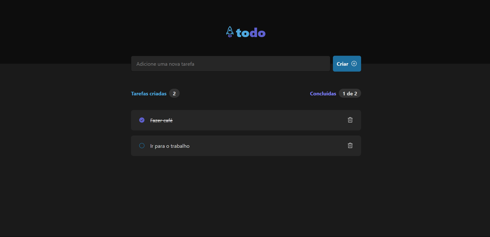

<h1 align="center"> todo-list </h1>

  <a href="#-tecnologias">Tecnologias</a>&nbsp;&nbsp;&nbsp;|&nbsp;&nbsp;&nbsp;
  <a href="#-projeto">Projeto</a>&nbsp;&nbsp;&nbsp;|&nbsp;&nbsp;&nbsp;
  <a href="#memo-licença">Licença</a>

  

 

  

## 🚀 Tecnologias

Esse projeto foi desenvolvido com as seguintes tecnologias:

- React
- TypeScript
- TailwindCSS

## 🔥 Algumas features neste projeto

- React Hooks
- UseState
- Estilização com TailwindCSS

## ✨ Neste projeto você pode ver

- Uma aplicação completa de criação de tarefas no estilo todo-list
- Tarefas que quando criadas podem ser marcadas como concluídas e deletadas
- Contador de tarefas cridas e tarefas concluídas com base no número de tarefas criadas

## 💻 Projeto

- Esta é uma aplicação completa de criação de tarefas criada com ReactJS e TailwindCSS

## ✅ Esse projeto foi criado ao longo do curso Ignite ReactJS da plataforma Rocketseat

## 📝 Licença

Esse projeto está sob a licença MIT.

---
